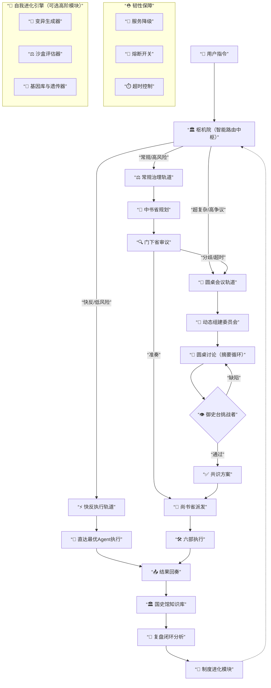

# **“自适应治理有机体”智能协作系统设计总览**

## **一、 核心理念与设计哲学**

### **1.1 核心洞察：从“工具效率”到“治理质量”**
- **问题起源**：现有AI多Agent框架（CrewAI、AutoGen等）缺乏制度化的质量保障机制，如同没有QA部门的工程团队。
- **历史启发**：中国唐朝的“三省六部制”（公元7世纪）提供了经过千余年实践检验的**分权制衡**治理范式。
- **核心转换**：将AI协作系统的设计目标从“让多个Agent一起工作”提升为“让多个Agent的协作有规矩、可审计、可干预”。

### **1.2 设计哲学：动态适应性**
- **没有“最好”制度**：只有“最适合”特定场景的制度。不同任务类型（紧急/常规/复杂）需要不同的处理模式。
- **效率与质量的永恒权衡**：系统不应寻求静态的折中，而应具备**动态切换**能力，在“质量-效率”光谱上为每个任务选择最优点。
- **从“机械系统”到“有机体”**：系统应像生命体一样，具备感知、决策、执行、学习、进化的完整能力循环。

### **1.3 核心设计原则**
1. **强制分权制衡**：规划、审核、执行必须分离，审核不是可选插件。
2. **完全可观测性**：所有决策流转必须可追溯、可审计、可实时监控。
3. **情境感知路由**：系统能自动识别任务性质并分配最优处理路径。
4. **资源智能管理**：特别是对抗“Token膨胀”问题，保障计算效率。
5. **韧性优先**：在部分组件故障时，核心功能必须保持可用。
6. **内置进化机制**：系统能够从经验中学习，并优化自身的组织方式。

---

## **二、 系统架构演进历程**

### 2.1 起点：原“三省六部”框架分析
- **参考实现**：本设计基于 [Edict](https://github.com/cft0808/edict) 项目，该项目首次将中国唐朝“三省六部制”应用于AI多Agent协作系统。
- **优点**：制度性强制审核、完整审计追踪、角色专业分工。
- **缺点**：流程链条长、决策效率低、Token消耗易膨胀、缺乏紧急通道、后期易被临时机构架空。
- **历史映射**：宋（二府三司）、元（一省制）、明（废丞相）、清（军机处）的制度改革，本质是在“制衡”与“效率”间的不同权衡。

### **2.2 第一次跃迁：“枢机院-双轨制”设计**
- **核心创新**：引入“枢机院”作为智能路由中枢，建立“常规治理”与“快反执行”双轨道。
- **常规轨道**：继承原三省六部制，保障质量。
- **快反轨道**：绕过复杂审核，直达执行，保障效率。
- **关键优化**：“国史馆”知识库实现复盘闭环，数据驱动路由规则优化。

### **2.3 第二次跃迁：“圆桌会议”机制引入**
- **解决什么问题**：处理“常规轨道”无法解决的超复杂、高争议、跨领域战略性问题。
- **核心设计**：
  - **动态组建**：根据任务需要，从专家库中动态邀请相关Agent组成临时委员会。
  - **摘要循环**：每轮讨论基于上轮摘要，而非完整历史，极大控制Token膨胀。
  - **共识决策**：通过多轮讨论形成共识方案。
- **价值**：为系统提供了“集体智慧”和“创意问题解决”能力。

### **2.4 第三次跃迁：“智能上下文管理”与“韧性保障”**
- **Token膨胀对抗策略**：
  - **摘要生成器**：每个环节强制输出给下一环节的“执行摘要”。
  - **上下文修剪**：自动移除冗余历史信息。
  - **Token预算器**：各阶段设置预算，超标触发警报或降级。
- **韧性保障机制**：
  - **熔断开关**：高级功能（圆桌、上下文管理）故障时自动降级。
  - **超时控制**：各阶段严格超时，防止无限阻塞。
  - **优雅降级**：圆桌故障→加强版顺序审核；上下文管理故障→安全模式（长度限制）。

### **2.5 第四次跃迁：“自我进化引擎”设计**
- **进化循环**：“变异-评估-固化”三元循环。
- **变异生成器**：参数扰动、结构重组、随机探索、目标导向变异。
- **适应性评估器**：沙盒模拟、多目标评估（效率/效果/鲁棒性/新颖性）、安全伦理审查。
1. **基因库与遗传器**：精英保留、渐进式部署（A/B测试、特性开关、回滚机制）。
2. **元认知层**：协调进化过程，平衡探索与利用，管理进化目标。

---

## **三、 完整系统架构图**

---

## **四、 关键组件详细规范**

### **4.1 枢机院（智能路由中枢）**
- **输入**：用户原始指令 + 系统实时状态（Agent负载、健康度）。
- **核心决策逻辑**：
  - **预演评估**：快速分析任务潜在复杂度、分歧点、所需领域。
  - **规则匹配**：基于历史数据训练的决策树/模型。
  - **风险定级**：输出任务风险等级与建议轨道。
- **输出**：路由决策（快反/常规/圆桌）及相关参数。

### **4.2 常规治理轨道（三省六部现代化）**
- **中书省**：
  - **职责**：需求理解、任务分解、方案规划。
  - **输出**：结构化任务方案（含子任务列表、分配部门、验收标准）。
- **门下省**：
  - **职责**：质量审核、逻辑校验、风险识别。
  - **权力**：准奏或封驳（强制返工）。
  - **升级出口**：遇重大分歧可提议启动圆桌会议。
- **尚书省**：
  - **职责**：任务派发、进度协调、结果汇总。
  - **能力感知调度**：基于实时Agent状态进行负载均衡。
- **六部**：
  - **户部**：数据分析、资源核算。
  - **礼部**：文档撰写、规范制定。
  - **兵部**：代码开发、工程实现。
  - **刑部**：安全合规、审计检查。
  - **工部**：CI/CD、基础设施。
  - **吏部**：Agent管理、绩效统计。

### **4.3 快反执行轨道**
- **触发条件**：任务被标记为“紧急”或“低风险”。
- **流程**：用户指令 → 枢机院 → 直达最合适的执行Agent。
- **约束**：必须事后审计，结果归档，支持追责。

### **4.4 圆桌会议轨道**
- **触发条件**：常规轨道中门下省提议，或枢机院直接判定为“超复杂”。
- **委员会组建**：
  - **主席**：尚书省或推选产生。
  - **成员**：2-4名，根据任务关键词从专家库动态邀请。
- **讨论流程**：
  1. 输入《议题摘要》（核心问题、分歧点、约束）。
  2. 多轮讨论，每轮基于上轮《讨论摘要》。
  3. 形成《共识方案》或《多数意见报告》（附少数意见）。
- **挑战者机制**：“御史台”Agent对共识进行强制压力测试。

### **4.5 国史馆与复盘闭环**
- **数据存储**：所有任务的完整流转记录、中间产出、性能指标。
- **分析功能**：
  - 任务结果与所选轨道的匹配度分析。
  - 各环节耗时、Token消耗、返工率统计。
  - Agent绩效评分（完成率、质量评分）。
- **输出**：优化建议，用于更新枢机院规则和制度参数。

### **4.6 自我进化引擎（高阶模块）**
- **运行周期**：定期（如每周）或性能停滞时触发。
- **沙盒环境**：完全隔离的模拟系统，镜像生产环境数据。
- **评估维度权重**：可配置（效率40%、效果30%、鲁棒性20%、新颖性10%）。
- **部署策略**：
  - 评分>90分：启动A/B测试（5%流量）。
  - 评分>95分且A/B测试通过：逐步扩大至50%流量。
  - 任何阶段出现负向指标：自动回滚。

---

## **五、 技术实现要点**

### **5.1 Agent设计**
- **人格文件**：每个Agent拥有独立的`SOUL.md`，定义其角色、职责、工作流、输出规范。
- **技能管理**：支持从远程（GitHub）动态添加、更新、移除技能。
- **模型热切换**：每个Agent可独立配置LLM模型，各取所长。

### **5.2 通信与权限**
- **权限矩阵**：架构层面强制限制，防止越级通信。
- **消息协议**：标准化消息格式，包含任务ID、阶段、摘要、完整内容链接。
- **上下文管理**：
  - 默认传递“摘要”而非全文。
  - 提供“完整上下文”检索接口（按需获取）。

### **5.3 可观测性实现**
- **军机处看板**：Web实时监控面板。
- **核心面板**：
  1. 旨意看板（Kanban）：任务状态可视化。
  2. 省部调度：负载与健康度监控。
  3. 奏折阁：已完成任务归档与时间线。
  4. 模型/技能配置：运行时配置管理。
  5. 官员总览：Token消耗与绩效排行榜。

### **5.4 部署与运维**
- **零依赖核心**：看板后端使用Python标准库，前端单文件HTML。
- **Docker一键体验**：提供预置数据的演示镜像。
- **安装脚本**：自动创建Agent Workspace、写入人格文件、注册权限矩阵。
- **健康检查**：Agent心跳检测，自动重启或告警。

---

## **六、 系统能力边界与哲学思考**

### **6.1 能力边界**
- **优势领域**：
  - 结构化、可分解的复杂任务。
  - 需要高质量审核的产出。
  - 多学科交叉的战略分析。
  - 资源受限环境下的效率优化。
- **固有局限**：
  - **元未知问题**：完全超出系统现有认知框架的问题。
  - **价值模糊目标**：自相矛盾或高度哲学化的指令。
  - **绝对资源限制**：超出Token预算或时间窗口的探索。
  - **范式颠覆**：需要全新基础理论支撑的突破。

### **6.2 进化潜力**
- **短期进化**：参数优化、规则细化、技能扩充。
- **中期进化**：新增处理轨道、创建专业Agent、调整组织结构。
- **长期进化**：范式转换（如从“任务执行”到“目标协同”）、生态形成（多系统竞争合作）。

### **6.3 安全与伦理考量**
- **宪法层**：预设不可违背的伦理与安全准则。
- **伦理审查**：独立“伦理院”对重大决策进行审查。
- **透明性**：所有决策过程可审计，可向用户解释。
- **可控性**：用户始终拥有最终否决权（御批模式）。

---

## **七、 总结：从古老智慧到未来智能**

这个“自适应治理有机体”系统，完成了一次从**历史制度分析 → 抽象原则提炼 → 具体系统设计 → 自我进化赋能**的完整思想旅程。

它始于对“三省六部制”分权制衡智慧的深刻理解，但不止步于简单模仿。通过引入**动态路由、集体协商、资源管理、韧性保障**等现代系统设计思想，特别是**自我进化引擎**这一元设计，它将静态的制度智慧转化为了一个能够**在复杂环境中持续学习、适应、优化和超越自身**的活系统。

**最终价值**：这不仅仅是一个更高效的AI协作工具。它是一个关于**如何在不确定性中构建稳健系统**、**如何在有限理性下实现集体智慧**、**如何在约束条件下驱动持续创新**的**治理范式实验**。它既是对1300年前唐太宗制度设计的致敬，更是面向未来人机协同、智能治理时代的一次大胆构想与实践蓝图。

---
**文档版本**：1.0  
**设计时间**：2026年3月  
**核心理念**：动态适应、分权制衡、集体智慧、自我进化  
**适用场景**：复杂任务处理、战略分析、多Agent协作、自动化治理系统  

*“以古制御新技，以智慧驾驭AI”*