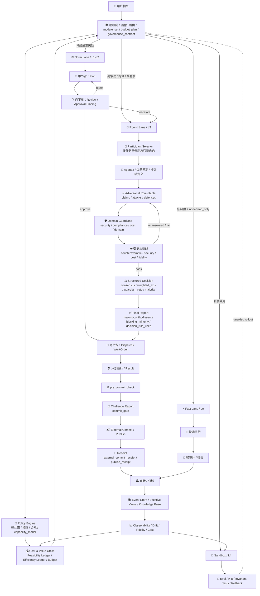
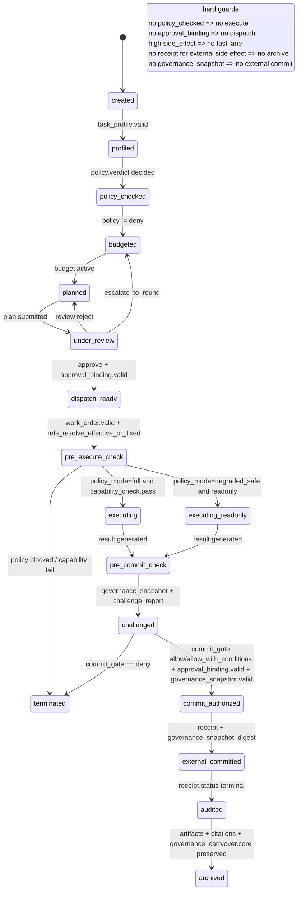

# ShuYuanAI v2.0 设计方案（全面补充完善版）

**主题**：成本感知的自适应治理有机体
**版本**：2.0（在 1.0 基础上升级）
**设计时间**：2026年3月
**核心变化**：从“制度完整”升级为“价值密度最大化 + 渐进式复杂度 + 成本预算制 + 价值验证优先”

---

## 0. v2.0 的一句话定位

ShuYuanAI 不是“更强的多 Agent”，而是一个**以治理质量为目标、以成本约束为边界、以可行性优先、以价值密度优化为第二目标**的智能协作系统：

> **每次增加复杂度，都必须用“可量化价值”支付得起。**

### 0.1 文档分层与权威顺序（避免规范漂移）

为保证设计、实现与校验一致，v2.0 文档按以下顺序生效：

1. `v2.0-schema.md`：**数据契约权威源**（Envelope、artifact_type、字段命名、JSON Schema）。
2. `v2.0-detail.md`：**流程与规则权威源**（路由、预算、降级、事件模型、产物模板）。
3. `v2.0-extractors.md`：**实现参考**（Extractor/Runner 伪代码与执行策略）。
4. `2.0.md`：**架构与治理总览**（目标、原则、演进路线与组织机制）。

若出现冲突，按以上顺序覆盖；跨文档复用字段命名必须与 `v2.0-schema.md` 保持一致。

---

## 1. 设计哲学与核心原则（v2.0 重点升级）

### 1.1 核心理念：成本感知的自适应治理（Value Density First）

ShuYuanAI 不再追求“功能完整”，而追求“价值密度最大化（Value Density Maximization）”。

#### 1.1.1 价值密度定义（系统的第一性指标）

把一次任务的“价值/成本”抽象成可计算指标：

* **成本 Cost**（可观测、可预算）

  * Token 成本（输入+输出+检索+摘要+讨论）
  * 时间成本（端到端延迟、各阶段等待）
  * 工具成本（外部 API、代码执行、CI/CD）
  * 风险成本（潜在安全/合规/错误代价的期望值）
* **价值 Value**（可验收、可度量）

  * 质量指标（正确性、完整性、可执行性、可复用性）
  * 用户效用（任务完成度、满意度、节省工时）
  * 风险降低（错误率下降、事故减少、审计通过率提升）
* **价值密度 VD**
  $$
  VD = \frac{Value}{Cost}
  $$
  系统的路由、模块加载、进化，最终都围绕 **VD 最大化**。

> v2.0 的关键不是"更聪明"，而是"每一步聪明都划算"。

#### 1.1.2 双账本目标：先可行，再优化（v2.1 升级）

v2.1 起，系统不再把 VD 直接当成"唯一目标函数"，而是采用两层决策：

1. **可行性账本（Feasibility Ledger）**
   - 判断任务是否满足政策、权限、摘要保真、审批绑定、外部副作用边界。
   - 只要任一硬门槛未通过，任务不得继续向外部提交。

2. **效率账本（Efficiency Ledger）**
   - 在可行任务集合内，比较 token、延迟、工具调用与质量收益。
   - VD 只在"已可行"的候选路径之间做优化，而不负责替代硬约束。

结论：**VD 是优化目标，不再是替代治理边界的总目标。**

---

### 1.2 核心设计原则（工程化扩写）

本节将原则转化为可实施机制，确保可直接落到代码、策略配置与验收标准。

| 原则          | 描述                         | 具体实现（可落地机制）                                                         |
| ----------- | -------------------------- | ------------------------------------------------------------------- |
| 渐进式复杂度      | 从最简单可用方案起步，按需增加复杂度         | **复杂度阶梯 L0-L4**（后文）；默认只启用低阶模块；只有当“风险/歧义/价值”满足阈值才升级                  |
| 动态模块加载      | 按任务特性调整模块组合                | 枢机院输出不仅含 lane，还含 **module_set**（启用：圆桌/御史台/深检索/强审计…）；Feature Flag 控制 |
| 成本预算制       | 每个任务有 token/时间/工具预算，超预算需审批 | **预算器 + 实时监控 + 超额审批**（门下省/度支署）；超预算触发“降级序列”，最后才申请加预算                 |
| 实时 Token 监控 | 成本必须可观测、可预警                | 每阶段 token_used / token_cap；P95 超限告警；“摘要漂移指数”“讨论收敛指数”同时监控            |
| 价值验证优先      | 新功能必须证明 ROI，不做“纯炫技模块”      | **实验计划先行**：A/B、灰度、指标口径、回滚阈值；未通过 ROI 评审不得全量                          |
| 故障安全设计      | 故障时自动降级，不崩溃                | 熔断（禁用高阶模块）+ 超时（强制收敛）+ 降级（换低成本路径）三重保障；安全模式输出“最小可用结果”                 |
| 持续进化（成本可控）  | 系统能自我优化，但不允许失控探索           | **小步快跑进化引擎**：变更预算、沙盒评估、隐藏保留集、线上护栏、随时回滚；“进化必须花钱、而且花得起”               |
| 强制分权制衡      | 规划/审核/执行分离，审核不可绕过          | 门下省“封驳权”是制度；快反仅允许绕过“部分流程”，不能绕过“宪法层/硬约束”                             |
| 完全可观测性      | 所有决策可追溯可审计                 | 统一消息信封（含证据锚点）；事件溯源 Event Store；时间线可重放；审计报告自动生成                      |
| 情境感知路由      | 自动识别任务性质并选择最优路径            | 任务画像：风险/歧义/规模/截止期/价值；路由输出含置信度、退出条件、冷却规则                             |
| 韧性优先        | 部分组件故障核心仍可用                | “核心零依赖运行核” + 可选插件；插件坏了自动熔断；核心仍可完成基本任务闭环                             |
| 用户最终否决权     | 治理系统永远可控                   | “御批模式”：关键决策可要求用户批准；提供可解释审计链（为什么这么路由/为什么封驳）                          |

---

## 2. v2.0 新增：复杂度阶梯（Complexity Ladder）与模块经济学

### 2.1 复杂度阶梯 L0–L4（把“渐进式复杂度”制度化）

这是 v2.0 最重要的“成本控制总闸门”：**任何任务默认从低阶开始**，只有满足升级条件才启用高阶模块。

* **L0：最小治理（Minimal Governance）**

  * 快反执行 + 轻量审计（必须归档）
  * 适用：低风险、明确、短任务
  * 成本：最低
* **L1：常规治理（Basic 3省6部）**

  * 中书规划 → 门下审核 → 尚书派发 → 六部执行 → 归档
  * 适用：中等风险、需验收标准
* **L2：强审计与成本管控（Cost & Quality Guardrails）**

  * 启用：预算器、证据锚点摘要、御史台基础挑战（反例/约束/安全）
  * 适用：高风险/合规敏感/容易出错任务
* **L3：动态跨学科委员会（Dynamic Cross-domain Committee）**

  * 适用：超复杂、高争议、跨领域战略问题
  * 默认机制：按任务画像动态召唤"临时委员会"，而非固定角色开会
  * 强制：
    - participant_selector（按任务画像选角色）
    - role_guardrails（角色职责边界）
    - adversarial_roundtable（结构化对抗，不是自由聊天）
    - stop_rules（停止规则 / 收敛判定）
    - majority_as_fallback（多数只作最后兜底，不是默认中心）
  * 裁决原则：
    - 可比的同轴问题，可进入多数裁决
    - 涉及 policy / capability / compliance / external side effect 的问题，不得被简单多数覆盖
    - 若存在未被反驳的高风险少数意见，应进入 blocking_minority 或升级御批
* **L4：自我进化（Evolution Engine）**

  * 只对“系统制度与策略”做变更，不直接对单任务做不可控探索
  * 必须：沙盒 + 线上护栏 + 可回滚 + 变更预算

> 直觉：L3、L4 都是“奢侈品模块”，必须在价值密度上证明自己值得。

---

### 2.2 模块经济学：模块的“成本/收益”必须可计量

对每个可选模块（例如圆桌、御史台深度测试、深检索、强化摘要等），定义：

* **模块成本**：预计额外 tokens / 时间 / 工具调用
* **模块收益**：缺陷率下降、返工率下降、满意度提升、风险降低
* **启用阈值**：满足哪些条件才自动启用
* **熔断条件**：成本异常、延迟异常、收益不足时自动禁用

这样“动态模块加载”就不是拍脑袋，而是一个可执行策略系统。

---

## 3. 总体架构（v2.0：多轨道 + 控制平面 + 成本价值中枢）

### 3.1 三层架构：执行平面 / 治理平面 / 控制平面

为了把“宪法层、预算器、实验、进化”真正纳入系统中枢，建议架构升级为三层：

1. **执行平面（Data Plane）**
   六部执行、工具调用、代码/文档产出

2. **治理平面（Governance Plane）**
   三轨道（快反/常规/圆桌）+ 分权制衡（中书/门下/尚书/御史台）

3. **控制平面（Control Plane）**（v2.0 新增关键）

* 宪法层（Policy Engine）：硬约束、合规、权限
* 成本价值中枢（Cost & Value Office）：预算、ROI、实验
* 观测与告警（Observability）：指标、看板、SLO
* 进化引擎（Evolution）：只在沙盒与护栏内工作

---

### 3.2 v2.0 架构图（Mermaid）


---

## 4. 关键制度机制（v2.0：把"成本与价值"写进流程）
### 4.1 任务画像（Task Profiling）——路由与预算的共同输入

枢机院必须先做“任务画像”，输出结构化特征：

* **紧急度**：deadline、SLA
* **风险级别**：安全/合规/资金/品牌风险
* **歧义度**：需求是否可验证、约束是否完整
* **复杂度**：子任务数量、跨域程度、依赖工具数
* **价值预估**：对用户的收益、错误代价
* **可逆性**：错了能否轻易回滚/撤销

> 任务画像的目的不是“精准预测”，而是让系统能做“有边界的理性决策”。

---

### 4.2 枢机院路由输出必须包含“五件套”（v2.0 强化）

你在 1.0 里是“快反/常规/圆桌”，v2.0 建议强制输出：

1. **lane_choice**：fast / norm / round
2. **complexity_level**：L0–L4
3. **module_set**：启用哪些模块（御史挑战/深检索/强摘要…）
4. **budget_plan**：token/time/tool-call 上限 + 分阶段预算
5. **governance_contract**：置信度、退出条件、冷却规则（防抖动）

示例（概念）：

```json
{
  "lane_choice": "norm",
  "complexity_level": "L2",
  "module_set": ["evidence_summary", "yushi_basic", "token_budgeter"],
  "budget_plan": {"token_cap": 4200, "time_cap_s": 300, "tool_cap": 8},
  "governance_contract": {
    "confidence": 0.78,
    "exit_conditions": ["if_disagreement_high -> round", "if_over_budget -> degrade_then_approve"],
    "cooldown": {"max_lane_switches": 1}
  }
}
```

### 4.2.1 治理状态机（Governance Kernel）

v2.0 将新增治理状态机，作为所有任务闭环的统一运行核。最小状态对象包括：

* **TaskState**：任务生命周期状态
* **PolicyState**：政策判定状态
* **BudgetState**：预算消耗状态
* **ArtifactState**：产物版本状态
* **ApprovalState**：审批流程状态
* **OperatingMode**：运行模式

#### 状态枚举

**TaskState**:
- created → profiled → policy_checked → budgeted → planned → under_review → dispatch_ready → pre_execute_check → executing / executing_readonly → pre_commit_check → challenged → commit_authorized → external_committed → audited → archived → terminated

**PolicyState**:
- unknown / allow / allow_with_constraints / deny

**BudgetState**:
- unset / active / near_soft_cap / approval_required / degraded / exhausted / terminated

**ArtifactState**:
- absent / draft / submitted / approved / superseded / revoked / effective

**ApprovalState**:
- not_required / pending / approved / rejected / expired

**OperatingMode**:
- emergency / emergency_deliberation / deliberative / exploratory / compliance_heavy

#### 核心转移规则

| 转移 | 触发条件 | 守护规则 |
|-----|---------|---------|
| created → profiled | task_profile.valid == true | 画像完成 |
| profiled → policy_checked | policy.verdict in [allow, allow_with_constraints, deny] | 宪法层已判定 |
| policy_checked → budgeted | policy.verdict != deny | 政策允许 |
| budgeted → planned | budget_state in [active, near_soft_cap] | 预算已核定 |
| planned → under_review | artifact.plan.state in [submitted, draft] | 方案已提交 |
| under_review → dispatch_ready | review.verdict in [approve, approve_with_conditions] + approval_binding.valid == true | 审批绑定生效版本 |
| under_review → planned | review.verdict == reject | 封驳 |
| under_review → budgeted | review.verdict == escalate_to_round | 升级圆桌 |
| dispatch_ready → pre_execute_check | work_order.valid == true + all_input_refs_resolve_effective_or_fixed | 输入已可解析 |
| pre_execute_check → executing | policy_mode == full + capability_check.pass == true + side_effect_level <= capability.max_side_effect_level | 满足正常执行条件 |
| pre_execute_check → executing_readonly | policy_mode == degraded_safe + side_effect_level in [none, read_only] | 进入安全降级只读执行 |
| pre_execute_check → terminated | policy_mode == blocked OR capability_check.pass == false | 执行前制度阻断 |
| executing / executing_readonly → pre_commit_check | result.generated == true | 已生成待提交结果 |
| pre_commit_check → challenged | governance_snapshot.created == true + challenge_report.created == true | 先冻结治理快照，再提交前挑战 |
| challenged → commit_authorized | challenge.overall.commit_gate in [allow, allow_with_conditions] + approval_binding.valid == true + governance_snapshot.valid == true | 仅表示允许提交，不表示已提交 |
| challenged → terminated | challenge.overall.commit_gate == deny | 提交被制度拒绝 |
| commit_authorized → external_committed | receipt.created == true + receipt.governance_snapshot_digest.present == true | 必须产生外部动作回执 |
| external_committed → audited | receipt.status in [success, partial_success, failed, rolled_back] | 进入事后审计 |
| audited → archived | required_artifacts_present + traceable_citations + governance_carryover.core_preserved == true | 归档条件满足 |
| any → terminated | safe_terminate | 安全终止 |

#### 治理状态机图（v2.1-r1）



#### Emergency Deliberation（v2.1-r1 新增）

适用：高失败代价 + 高时效压力 + 不允许进入 fast lane 的任务。

制度要求：

1. 不得绕过 policy、capability、approval、challenge、receipt。
2. 最小编制固定为：proposer / adversary / synthesizer / guardian。
3. 至少 1 轮结构化对抗，至少 1 次基础挑战。
4. policy / capability / compliance / external_side_effect 不得由简单多数覆盖 guardian 阻断意见。
5. 默认输出：

   * structured_options
   * dominant_risks
   * recommended_next_30m_action
   * do_not_do_list

#### 不可逆操作边界（v2.1-r1）

v2.1 起，所有任务都必须显式声明 `side_effect_level`：

* `none`：纯推理 / 纯分析 / 不写外部状态
* `read_only`：只读查询 / 只读工具调用
* `internal_write`：仅写内部草稿、内部状态、内部工件
* `external_write`：会对外部系统产生可见写入
* `external_commit`：会触发发布、发送、部署、付款、审批生效等不可逆或半不可逆动作

制度要求：

1. `side_effect_level > read_only` 的任务不得进入 fast lane。
2. `side_effect_level > capability_model.max_side_effect_level` 时，执行前必须直接终止。
3. `side_effect_level in [external_write, external_commit]` 时，必须经过 `pre_commit_check`。
4. `external_commit` 必须满足：

   * 审批绑定仍有效；
   * challenge_report.overall.commit_gate != deny；
   * rollback_plan 已存在；
   * governance_snapshot 已持久化；
   * 审计字段完整。

#### 提交回执要求（v2.1-r1）

为了把"允许提交"和"已经提交"严格区分，v2.1-r1 规定：

1. `side_effect_realized in [external_write, external_commit]` 时，必须生成 `external_commit_receipt` 或 `publish_receipt`。
2. 没有 receipt，不得把任务从 `commit_authorized` 推进到 `external_committed`，也不得直接归档。
3. receipt 必须绑定：

   * `request_digest`
   * `approval_binding_digest`
   * `commit_gate_snapshot`
   * `request_idempotency_key`
   * `governance_snapshot_digest`
4. 若 `receipt.status in [failed, rolled_back]`，必须保留 `rollback_handle` 与 `remediation_note`。
5. publish 属于 external commit 的特例；若系统区分"发布行为"，则优先产出 `publish_receipt`。

#### 关键不变量

- 无 `policy_checked` 不可执行
- 无审批绑定不可派发
- fast lane 不得进入快反禁区
- `side_effect_level > read_only` 不得绕过 `pre_commit_check`
- `side_effect_level > capability.max_side_effect_level` 不可执行
- 无有效 citations 不可归档
- 无 `governance_carryover` 不得做高风险摘要压缩
- `challenge.overall.commit_gate = allow/allow_with_conditions` 只表示"可提交"，不得等价为"已提交"
- 若 `side_effect_realized in [external_write, external_commit]`，无 receipt 不得 archived
- `task_mode = exploration` 默认不得直接执行 `side_effect_level >= external_write`；若必须提交，需拆分为"exploration 产出候选方案" + "production 子任务执行提交"
- final_report 若为 `majority_with_dissent`，不得丢失 minority_view 与 open_disagreements

> 治理状态机的目的不是"精准跟踪"，而是让系统能做"可回溯的治理决策"。

### 4.2.2 运行模式（Operating Mode）

为任务增加显式 `operating_mode`，建议支持：

* **emergency**：紧急模式，优先效率，可跳过部分审核
* **deliberative**：审议模式，优先质量，严格执行分权制衡
* **exploratory**：探索模式，允许尝试，输出多个方案供选择
* **compliance_heavy**：合规模式，优先合规，必须通过所有检查

运行模式影响：
* 同一 lane 在不同治理模式下可有不同的预算、审批与测试强度
* emergency 模式并不自动等于快反，需满足快反禁区规则

### 4.2.3 快反禁区规则

当任务满足以下条件时，不得进入 fast lane：

* 低可逆性（reversibility=low）+ 高失败代价（failure_cost=high）
* 涉及敏感数据（data_sensitivity=pii/confidential）
* 涉及合规域（compliance_domain 包含 medical/finance/legal/security）

> 这保证快反轨道不会被滥用为"绕过治理的快捷通道"。

### 4.2.4 探索模式补充约束（v2.1 增补）

- `task_mode = exploration` 的任务，默认只允许 `side_effect_level in [none, read_only, internal_write]`
- 若探索任务需要 `external_write / external_commit`，必须拆成两阶段：
  1. exploration 只生成候选方案、证据与边界说明；
  2. production 子任务负责实际外部提交
- 未形成 `negative_findings` 与 `recommended_next_step` 的探索结果，不得记为"高价值探索"
- 探索模式允许低短期 VD，但不得绕过 policy、capability、approval、commit_gate 与 receipt 规则

---

### 4.3 成本预算制（Token/时间/工具三预算）与“超预算审批”

v2.0 建议把预算当成**制度**而不是“监控指标”。

#### 4.3.1 预算类型

* **硬预算（Hard Cap）**：超了必须停或降级（默认）
* **软预算（Soft Cap）**：超了触发审批，可加预算（仅高价值任务）

#### 4.3.2 超预算处理的"降级序列"（先降级、后审批）

当逼近预算上限时，系统按顺序尝试：

1. **压缩普通上下文**（更短摘要、减少非关键叙述），但不得压缩或删除 `governance_carryover`，且不得删除 citations、hard constraints、approval_binding、minority_view、open_disagreements、known_limits、failed self_check、critical risk notes
2. **减少参与者**（圆桌减员、缩轮数）
3. **降低挑战强度**（御史台从深度对抗降为基础约束检查）
4. **切换 lane**（Round→Norm、Norm→Fast 需满足硬约束）
5. **申请加预算**（门下省 + 度支署审批）
6. **安全终止**（输出最小可用结果 + 风险提示 + 下一步建议）

> 这保证系统永远不会因为"想做完美"而失控烧 token。
>
> 若任务 `side_effect_level >= external_write`，即便发生超预算，也不得通过"降级"绕过 `pre_commit_check` 与 `commit_gate`。

---

### 4.4 价值验证优先（ROI Gate）：新功能/新制度必须先给出收益口径

“A/B 测试、价值量化指标”必须制度化为 **上线门槛**：

#### 4.4.1 任何新模块上线必须提交《价值证明单》

至少包含：

* 目标：提升什么指标（例如返工率下降 20%）
* 成本：预计 token + 延迟增加
* 风险：可能引入什么副作用
* 实验设计：A/B 分流比例、持续时间、回滚阈值

#### 4.4.2 指标必须成对出现（收益指标 + 护栏指标）

* **收益指标**：质量分、任务成功率、用户节省时间
* **护栏指标**：token/任务、P95 延迟、故障率、封驳率异常、外泄风险告警

> 没有护栏的“进步”往往是奖励黑客。

---

## 5. 核心组件规范（v2.0 补全与加固）

### 5.1 宪法层 Policy Engine（v2.0 必须成为硬闸）

作用：**所有轨道都不能绕过**。快反也必须过宪法层。

#### 宪法层职责

* 安全红线：禁止危险工具链、禁止越权数据访问
* 数据分级：PII/机密/内部/公开的传播规则
* 工具授权：允许哪些工具、速率限制、输出审查
* 合规策略：审计留痕、保留期、可导出策略

#### 输出

* `policy_verdict`: allow / allow_with_constraints / deny
* `constraints`: 强制约束注入到任务合同中

#### 能力模型（Capability Model）

v2.0 将当前以 hard/soft constraints 为主的文本规则，升级为可执行的能力模型。最小能力对象包含：

* `allowed_tools`：允许使用的工具列表
* `forbidden_tools`：禁止使用的工具列表
* `data_scope`：允许访问的数据范围
* `network_scope`：网络访问范围
* `redaction_required`：必须脱敏的内容类型
* `approval_required_for`：需要审批的操作列表
* `max_side_effect_level`：最大副作用级别

任何工具调用、数据域访问、外部连接请求，都应能在执行前完成 capability check；权限违规不再只是事后发现。

---

### 5.2 度支署（成本与价值中枢）（v2.0 新增关键机构）

你原先“户部”负责资源核算，但 v2.0 建议把“预算/ROI/实验”提升为跨省部的控制平面能力，单独设一个“度支署”（古意也很贴）：

#### 度支署职责

* 预算核定：token/time/tool cap
* 超预算审批：是否追加预算、追加多少
* ROI 门控：新模块/制度上线的价值验证
* 成本会计：每任务、每模块、每 Agent 的成本账本
* 价值账本：每任务产出质量、复用率、返工率等

> 度支署让“成本感知”从理念变成组织权力结构。

---

### 5.3 国史馆（Event Store + 知识库）升级为“双库结构”

你 1.0 里国史馆是知识库 + 复盘。v2.0 建议拆成两部分：

1. **事件库（Event Store，append-only）**

* 记录每一步：路由、封驳、派发、执行、工具调用摘要、预算事件
* 用于审计、重放、指标计算（不可变更）

2. **知识库（Knowledge Base，可演进）**

* 可被更新：最佳实践、模板、常见缺陷、路由规则经验
* 由复盘分析与进化引擎写入

---

### 5.4 门下省（审核机构）v2.0 强化：从“质量审核”升级为“质量×成本×风险”三审

门下省输出不再只有“准奏/封驳”，而是：

* 质量是否达标（验收标准是否完整）
* 风险是否可控（是否触碰宪法层约束）
* 成本是否划算（是否出现不必要的高阶模块）

门下省新增一个权力：

* **“节制令”**：要求降低复杂度（例如 L3 降到 L2），当价值密度不划算时强制降级。

---

### 5.5 御史台（挑战者）v2.0 固化为“标准测试清单”

把“挑战”从抽象升级为可复用的测试资产。建议至少四类测试：

1. **反例测试**：找最可能失败的输入/边界条件
2. **约束测试**：对照 hard_constraints 逐项验证
3. **安全测试**：注入、越权、泄露、工具滥用
4. **成本测试**：预估 token/工具调用是否超预算；是否存在“无意义冗长”

输出：

* `challenge_report`（含缺陷列表、严重性、证据锚点、建议修复）

---

### 5.6 圆桌会议（L3）v2.0 必须加"停止规则"（防无限讨论）

圆桌必须满足三个停止条件之一：

* **轮数上限**：默认 4–6 轮
* **收敛判定**：连续两轮《讨论摘要》的"关键要点差异"低于阈值
* **分歧不可消解**：输出《多数意见报告 + 少数意见 + 风险提示》，禁止硬凑共识

并且圆桌每轮必须输出：

* 《讨论摘要》（可传递）
* 《证据锚点》（可追溯）
* 《未决分歧列表》（防被摘要吞掉）

---

### 5.6.1 L3 动态跨学科委员会机制（v2.2 增补）

L3 不再被定义为"固定若干角色讨论后投票"，而被定义为：

> **依据任务画像动态组建的、有限编制的、职责异质的临时委员会。**

#### 角色选择原则

委员会成员由 `participant_selector` 根据任务画像自动生成，主要依据：

- `cross_domain`
- `stakeholder_count`
- `compliance_domain`
- `side_effect_level`
- `task_mode`
- `estimated_value`
- `failure_cost`

#### 最小编制（默认 3–5，硬上限 7）

1. `proposer`：主方案提出者
2. `adversary`：反例挑战者（必须常驻）
3. `synthesizer`：综合裁决者
4. `guardian.security_or_compliance`：当任务涉及安全/合规域时强制加入
5. `guardian.cost`：当成本/预算成为主要冲突轴时加入
6. `guardian.domain`：按主题相关性加入一个或多个领域守门角色
7. `guardian.external_effect`：当 `side_effect_level >= external_write` 时强制加入

#### 决策规则

- `consensus`：仅当关键冲突轴已被解决时使用
- `majority`：仅可用于"同一冲突轴内部"的可比问题
- `weighted_axis`：当是成本/速度/覆盖/效果等取舍问题时使用
- `guardian_veto`：当守门角色指出硬约束冲突、不可逆外部副作用风险、证据链断裂时可触发
- `user_escalation`：当 blocking minority 未被消解时，交由御批

#### 少数意见分级

- `informational_minority`：保留但不阻断流程
- `blocking_minority`：若指出以下任一问题，则不得被简单多数覆盖：
  - policy / capability 冲突
  - compliance / security 红线
  - 外部副作用高风险
  - 关键假设未证
  - 证据链断裂
  - 未回答的强反例

#### 预算原则

- 默认 3–5 角色，超过 5 名必须说明新增价值
- 当 `token_used/cap >= 0.85` 时，优先减少非核心成员，不得删除 proposer / adversary / synthesizer / 必选 guardian
- 多数机制只在"无 guardian_veto、无 blocking_minority、无未回答关键反例"时才可作为收敛手段

---

### 5.7 自我进化引擎（L4）v2.0：小步快跑 + 变更预算 + 护栏回滚

你 1.0 的进化引擎很完整，v2.0 的核心是**“进化也要成本感知”**。

#### v2.0 进化三条硬规则

1. **变更预算**：每周期可尝试的变异次数/评估 token 上限固定
2. **宪法层不变量测试**：任何变异必须先过硬约束（安全/成本上限/可解释性）
3. **线上护栏 + 自动回滚**：护栏指标触发就回滚，不允许“带病扩流”

#### 基因位点（建议标准化）

* 路由策略基因：阈值、权重、冷却时间、退出条件
* 组织结构基因：是否启用圆桌、委员会规模、挑战强度
* 上下文基因：摘要长度、引用密度、检索策略
* 权限基因：工具白名单、数据域访问策略

> 这样才能 A/B、才能回滚、才能说清楚"到底变了什么"。

### 5.8 禁止摘要化区段（No-Summary Zones）（v2.1 升级）

为防止治理关键信息在摘要链路中被稀释，以下内容不得仅以自由摘要形式传递，必须结构化透传：

- policy.hard_constraints
- capability_model 中的 side-effect / approval / network / redaction 约束
- review_report.approval_binding
- challenge_report.overall.commit_gate / blocking_reasons
- result.failed_self_check / known_limits
- final_report.open_disagreements / minority_view
- 所有 critical severity 风险与反证

这些字段统一进入 `governance_carryover`，并在后续阶段强制透传。

---

## 6. 统一消息信封（v2.0：证据锚点是强制字段）

在 1.0 审计追踪基础上，v2.0 将“摘要漂移”提升为重点风险，制度化解决方案是：
**摘要必须带证据锚点（citations）**，否则摘要不算合规产物。

### 6.1 最小合规消息信封字段（建议）

* task_id / trace_id / lane / stage / artifact_type
* producer / reviewer / approver
* summary（短）
* citations（证据锚点：指向事件库、文档 hash、片段索引）
* hard_constraints
* token_budget / token_used / truncation_events

这会让：

* 审计可重放
* 摘要不会“口说无凭”
* 圆桌摘要循环不至于越传越偏

---

## 7. 成本与价值指标体系（v2.0 必须有“账本”）

### 7.1 成本指标（Cost Ledger）

* token_per_task（均值/P95）
* latency_end_to_end（均值/P95）
* tool_calls_per_task
* over_budget_rate（超预算比例）
* degrade_rate（降级比例、降级原因分布）

### 7.2 质量指标（Quality Ledger）

* acceptance_pass_rate（一次验收通过率）
* menxia_reject_rate（封驳率）
* rework_rate（返工率）
* defect_density（御史台发现缺陷/产物长度）
* audit_findings（事后审计问题数）

### 7.3 价值指标（Value Ledger）

* user_time_saved（估算）
* artifact_reuse_rate（产物复用率）
* incident_avoidance（风险事件减少）
* satisfaction_score（如果有用户反馈渠道）

### 7.4 价值密度看板（VD Dashboard）

核心就是把这些指标组合成：

* **VD 总分**
* VD 按 lane 分布
* VD 按模块分布（模块经济学）
* VD 按 Agent 排行（但要防止指标投机）

### 7.5 VD 指标体系升级（两层决策）

v2.0 保留 Cost Ledger、Quality Ledger、Value Ledger 与 VD Dashboard，但将 VD 的使用方式调整为"两层决策"：

**第一层：可行性门槛**

* 政策合规通过（policy_verdict = allow / allow_with_constraints）
* 风险不过阈（risk_score < 阈值）
* 关键质量达标（acceptance_pass_rate >= 基准）
* 审计可重放（事件链完整）

**第二层：在可行集内比较**

* token 效率
* latency 效率
* tool calls 效率
* rework 效率
* 缺陷与事故避免收益

> 从 v2.0 起，高风险任务不会因为"成本更高"而被系统性错误降级；VD 的意义从"单一优化目标"改为"在安全可行前提下优化效率"。

---

## 8. 韧性保障（v2.0：降级树 + 安全模式输出）

### 8.1 三重保障（你 1.0 里很好，v2.0 加“降级树”）

* **熔断**：高阶模块一键禁用（圆桌/进化/深检索）
* **超时**：每阶段硬超时，超时输出最小可用结果
* **降级**：L3→L2→L1→L0 的自动降级路径

### 8.2 安全模式输出规范（必须）

当系统降级或被迫终止时，仍需输出一个“合规最小结果”：

* 已完成内容（可用部分）
* 未完成原因（预算/超时/政策拒绝）
* 风险提示（哪些结论不可信）
* 下一步建议（如何继续、需要用户补充什么）

---

## 9. 路线图（v2.0：把“成本与价值”前移到第一阶段）

你原路线图合理，但 v2.0 的核心是：
**不要等到 Phase 2/3 才上成本与价值闭环，必须前移。**

### Phase 0（最小闭环）

* 事件库 Event Store（append-only）
* 统一消息信封（含证据锚点字段）
* 常规治理最小链：中书→门下→尚书→执行→归档
* 看板最小版：任务时间线 + token/延迟

### Phase 1（成本感知治理落地：v2.0 的“灵魂”）

* 任务画像 + 枢机院路由（规则版）
* 复杂度阶梯 L0-L2
* 度支署：预算器 + 超预算降级序列 + 审批
* 御史台基础挑战（反例/约束/安全/成本）

### Phase 2（集体智慧：圆桌成为“奢侈品模块”）

* 圆桌会议（L3）+ 停止规则 + 多数/少数意见输出
* 动态模块加载（module_set + feature flag）
* 模块经济学（模块成本收益账）

### Phase 3（自我进化：小步快跑）

* 进化引擎（L4）+ 变更预算 + 宪法层不变量测试
* A/B 灰度平台 + 自动回滚护栏
* 基因位点标准化

### Phase 4（生态与扩展）

* 多系统互联协议
* 技能市场、模板库
* 人机协同御批流（关键任务 human-in-the-loop）

---

## 10. 附录：建议你在 v2.0 文档里新增的“标准模板”（直接可用）

### 10.1 《任务合同 Governance Contract》（由枢机院输出）

* 任务目标与验收标准
* lane + 复杂度级别 Lx + module_set
* hard_constraints（宪法层约束）
* budget_plan（token/time/tool cap）
* exit_conditions + cooldown
* 审计等级（轻/中/重）

### 10.2 《门下省封驳单》

* 封驳原因（质量/风险/成本/合规）
* 缺陷列表（严重性）
* 证据锚点 citations
* 返工要求（必须补齐哪些验收标准）
* 建议降级/升级（L2→L1 或 L1→L3）

### 10.3 《圆桌多数/少数意见报告》

* 共识部分（可执行方案）
* 未达成共识部分（分歧点 + 各方理由）
* 风险与代价（成本/时间/失败模式）
* 建议决策（若需御批，给出选项）

### 10.4 《复盘报告（国史馆）》

* 任务画像 vs 实际表现偏差
* lane 选择是否正确
* 成本账：token/延迟/工具
* 质量账：封驳率/返工率/缺陷
* VD 结论：哪些模块划算/不划算
* 建议：路由规则调整/模板更新/权限策略更新

---

# 总结：v2.0 的“完成态”是什么样？

如果按上面补齐，ShuYuanAI v2.0 会有三个非常明确的系统性特征：

1. **它不是更复杂，而是更“会克制”**：复杂度是可开关、可计费、可证明的。
2. **它不是更会写，而是更“能交付并可追责”**：证据锚点 + 事件库让每个结论都有出处。
3. **它不是盲目进化，而是“花得起的进化”**：进化也要预算、要护栏、要回滚。
