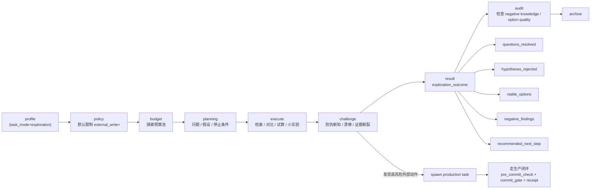

# A. 枢机院策略表（L0–L4）与“成本感知路由”规则

## A1. 任务画像（Task Profile）统一输入格式

枢机院路由前，先把用户指令归一化成一个**任务画像**对象（可以由一个轻量 Agent 或规则解析器生成）。

### A1.1 任务画像字段（建议最小集）

```json
{
  "task_intent": "build | analyze | write | code | operate | decide",
  "task_mode": "production | exploration | governance_evolution",
  "deadline_seconds": 600,
  "reversibility": "high | medium | low",
  "side_effect_level": "none | read_only | internal_write | external_write | external_commit",
  "data_sensitivity": "public | internal | confidential | pii",
  "compliance_domain": ["none | finance | medical | legal | security"],
  "tooling_required": ["none | code_exec | external_api | deploy"],
  "stakeholder_count": 1,
  "cross_domain": true,
  "spec_clarity": "high | medium | low",
  "expected_output_size": "S | M | L",
  "estimated_value": "low | medium | high",
  "failure_cost": "low | medium | high",
  "user_request_urgency": "low | medium | high"
}
```

> `task_mode` 用于把生产任务、探索任务、制度进化任务分账；`side_effect_level` 用于控制是否允许进入快反、是否必须提交前审核。

---

## A2. 五维评分（把“情境感知”变成可计算）

为了让路由可解释、可审计，建议把画像映射为 5 个分数（0–100），并把**计算依据写进日志**：

* **RiskScore（风险）**：数据敏感、不可逆操作、合规域、失败代价
* **AmbiguityScore（歧义）**：验收标准缺失、约束冲突、目标模糊
* **ComplexityScore（复杂度）**：跨域、子任务数、工具调用、输出规模
* **ValueScore（价值）**：预计收益、复用潜力、节省工时
* **UrgencyScore（紧急）**：deadline、业务紧迫性

### A2.1 简化评分规则（足够工程可用）

你可以先用规则评分（不依赖模型），后续再用数据拟合权重。

**RiskScore**

* data_sensitivity：public 0 / internal 20 / confidential 50 / pii 70
* compliance_domain：每个域 +10（上限 +30）
* reversibility：high 0 / medium +15 / low +30
* side_effect_level：none 0 / read_only +5 / internal_write +15 / external_write +30 / external_commit +45
* failure_cost：low 10 / medium 30 / high 60
* tooling_required：deploy +20，external_api +10

**AmbiguityScore**

* spec_clarity：high 10 / medium 35 / low 70
* cross_domain：true +10
* stakeholder_count ≥3：+10
* “验收标准缺失”检测到：+20（靠中书省规划时的结构化检查）

**ComplexityScore**

* cross_domain：true +20
* expected_output_size：S 10 / M 30 / L 60
* tooling_required：code_exec +10 / external_api +20 / deploy +35
* 预估子任务数：每 3 个 +10（上限 +30）

**ValueScore**

* estimated_value：low 20 / medium 50 / high 80
* 复用潜力（可由规则：模板类/规范类/组件类）：+10～+20
* failure_cost=high：+10（因为避免事故的价值也算价值）

**UrgencyScore**

* deadline_seconds：<120 => 90；<600 => 60；<3600 => 35；否则 15
* user_request_urgency：low 10 / medium 30 / high 60（取 max）

---

## A3. L0–L4 复杂度阶梯策略表（默认预算 + module_set + 门槛）

> 核心原则：**默认低阶**；升级要有证据；超预算先降级后审批。

### A3.1 复杂度阶梯总表

| Level                | 默认轨道        | 适用典型         | 默认 module_set                                                                                                             | 默认预算（token/time/tool）      | 强制产物                                      | 升级条件（任一满足）                                                           | 降级触发（任一满足）                                    |
| -------------------- | ----------- | ------------ | ------------------------------------------------------------------------------------------------------------------------- | -------------------------- | ----------------------------------------- | -------------------------------------------------------------------- | --------------------------------------------- |
| **L0 最小治理**          | Fast（快反）    | 低风险、清晰、短平快   | `audit_light`, `policy_gate`, `token_meter`                                                                               | **1200 / 60s / 3**         | Result + AuditNote                        | Risk≥35 或 data≠public/internal；Ambiguity≥40；需要 deploy；失败代价 medium+   | token>85% 且价值不高 → 输出最小可用结果；工具失败率>30%→转L1      |
| **L1 常规治理**          | Norm（三省六部）  | 常规任务、有验收     | `plan_struct`, `review_basic`, `dispatch`, `audit_basic`, `policy_gate`, `token_budgeter`                                 | **3000 / 180s / 6**        | Plan + Review + WorkOrder + Result        | Risk≥55；Ambiguity≥55；Complexity≥60；跨域+高价值；门下封驳2次                     | token>85%→压缩上下文/缩短产物；延迟超SLO→减少模块/转L0（需满足硬约束）  |
| **L2 强治理（质量×成本×安全）** | Norm（强化）    | 高风险/合规/易错    | `evidence_summary`, `yushi_basic`, `constraint_check`, `cost_guard`, `policy_gate`, `token_budgeter`, `drift_detector`    | **5200 / 300s / 10**       | + ChallengeReport + EvidenceMap           | Risk≥75；Ambiguity≥70；复杂多工具；门下分歧严重；需对外发布/决策类                          | token>90%→减少御史强度/减检索；连续两轮 drift↑→要求回到原文证据重建摘要 |
| **L3 动态委员会（跨学科对抗）** | Round（圆桌） | 超复杂、高争议、跨域战略 | `participant_selector`, `role_guardrails`, `adversarial_roundtable`, `evidence_summary`, `yushi_redteam`, `stop_rules`, `decision_protocol`, `policy_gate`, `token_budgeter` | **9000 / 600s / 15**（每轮上限） | Agenda + RoundSummaries + FinalReport | 争议预测高（stakeholder≥3 且 spec_clarity low）；跨域且 Value≥70；门下超时/分歧；风险与价值都高 | 收敛判定达成→降回L2/L1执行；轮数/预算到上限→输出结构化分歧报告并结束 |
| **L4 自我进化（系统级）**     | Sandbox（离线） | 改路由/制度/模板    | `sandbox_eval`, `ab_test`, `rollback`, `invariant_tests`, `change_budget`                                                 | **独立预算池**（每周/每周期）          | ChangeProposal + EvalReport + RolloutPlan | 仅由“性能停滞/指标异常/计划周期”触发，不由单任务触发                                         | 护栏指标触发→自动回滚；ROI不达标→变更废弃                       |

---

## A4. module_set 模块目录（可配置“模块经济学”）

建议把模块当作“可计费插件”，每个模块都有：成本估计、收益目标、启用门槛、熔断条件。

### A4.1 模块清单（建议最小可用集）

| 模块名                     | 作用         | 典型额外成本 | 主要收益指标     | 启用门槛       | 熔断条件                         |
| ----------------------- | ---------- | -----: | ---------- | ---------- | ---------------------------- |
| `policy_gate`           | 宪法层硬闸      |      低 | 合规事故=0     | 全部任务强制     | Policy服务不可用→进入安全模式（deny外部工具） |
| `token_meter`           | 实时token统计  |      低 | 超预算率下降     | L0+ 默认     | 监控不可用→按硬上限截断                 |
| `token_budgeter`        | 分阶段预算+超额流程 |    低-中 | token/任务下降 | L1+        | 预算器异常→按硬上限+降级                |
| `audit_light`           | 轻审计归档      |      低 | 可追责        | L0         | 归档失败→本地缓冲重试                  |
| `plan_struct`           | 中书结构化规划    |      中 | 返工率下降      | L1+        | 超时→降级为短计划                    |
| `review_basic`          | 门下基本审查     |      中 | 缺陷率下降      | L1+        | 超时→输出“带风险提示的准奏/封驳”           |
| `evidence_summary`      | 带证据锚点摘要    |      中 | 摘要漂移下降     | L2+ / 圆桌必选 | 引用缺失→判不合格，要求回补               |
| `drift_detector`        | 摘要漂移检测     |      中 | 漂移事故下降     | L2+        | 误报高→降级为抽检                    |
| `constraint_check`      | 硬约束逐项核对    |      中 | 合规通过率提升    | L2+        | 规则库不可用→仅执行宪法层基础规则            |
| `cost_guard`            | 成本收益守门     |      中 | VD提升       | L2+        | 不可用→仅预算控制                    |
| `yushi_basic`           | 御史基础挑战     |    中-高 | 缺陷密度下降     | L2         | 超时/预算紧→减少测试维度                |
| `yushi_redteam`           | 御史对抗/红队            |      高 | 高风险事故下降            | L3               | 预算>85%→降为basic |
| `participant_selector`    | 按任务画像动态召唤委员会成员 |      中 | 降低角色同质化 / 提升相关性 | L3               | 无法生成角色→退回最小固定编制 |
| `role_guardrails`         | 规定角色职责与不可越界范围   |      低 | 防角色同质化 / 防职责漂移   | L3               | 不可用→采用默认职责模板 |
| `adversarial_roundtable`  | 结构化对抗（claims/attacks/defenses） | 高 | 复杂问题成功率↑ / 伪共识下降 | L3 | 超时/收敛不足→输出结构化分歧报告 |
| `decision_protocol`      | 结构化裁决（consensus / weighted_axis / guardian_veto / majority） | 中 | 裁决透明 / 降低误判 | L3 强制 | 不可用→只允许输出"未决分歧 + 御批建议"，不得裸多数 |
| `sandbox_eval`          | 沙盒评估       |      高 | 进化安全       | L4         | 沙盒不可用→禁止变更上线                 |
| `ab_test`               | A/B灰度      |      中 | ROI验证      | L4         | 指标不可用→停止扩流                   |
| `rollback`              | 自动回滚       |      低 | 降事故        | L4 强制      | 回滚链路不可用→禁止扩流                 |
| `invariant_tests`       | 宪法不变量测试    |      中 | 安全红线       | L4 强制      | 测试不可用→禁止上线                   |
| `change_budget`         | 进化变更预算     |      低 | 控制探索成本     | L4 强制      | 不可用→禁用进化                     |

---

## A5. 路由规则（可直接写成 YAML/规则引擎配置）

下面给一个**可直接落到配置文件**的“初版规则集”。（你后面做进化引擎时，变异的也主要是这些阈值与分支）

### A5.1 路由 YAML（示例）

```yaml
version: 1
defaults:
  cooldown:
    max_lane_switches_per_task: 1
    no_switch_minutes: 15
  budgets:
    L0: { token_cap: 1200, time_cap_s: 60, tool_cap: 3 }
    L1: { token_cap: 3000, time_cap_s: 180, tool_cap: 6 }
    L2: { token_cap: 5200, time_cap_s: 300, tool_cap: 10 }
    L3: { token_cap: 9000, time_cap_s: 600, tool_cap: 15 }

rules:
  - name: deny_or_restrict_by_policy
    if:
      any:
        - data_sensitivity: pii
        - compliance_domain_contains: [medical, finance, legal, security]
    then:
      inject_modules: [policy_gate]
      enforce_constraints: [no_external_network_by_default]

  - name: fast_lane_only_low_risk
    if:
      all:
        - risk_score_lt: 35
        - ambiguity_score_lt: 40
        - tooling_required_not_contains: [deploy]
        - side_effect_level_in: [none, read_only]
        - data_sensitivity_in: [public, internal]
    then:
      lane: fast
      level: L0
      modules: [policy_gate, token_meter, audit_light]
      confidence: 0.75

  - name: l3_dynamic_committee_for_high_dispute
    if:
      any:
        - ambiguity_score_gte: 70
        - cross_domain: true
        - stakeholder_count_gte: 3
      all:
        - value_score_gte: 70
        - risk_score_gte: 55
    then:
      lane: round
      level: L3
      modules:
        [
          policy_gate,
          token_budgeter,
          evidence_summary,
          participant_selector,
          role_guardrails,
          adversarial_roundtable,
          yushi_redteam,
          stop_rules,
          decision_protocol
        ]
      confidence: 0.70

  - name: committee_guardian_injection
    if:
      any:
        - compliance_domain_contains: [medical, finance, legal, security]
        - side_effect_level_in: [external_write, external_commit]
        - data_sensitivity_in: [confidential, pii]
    then:
      committee_requirements:
        must_include_roles:
          - proposer
          - adversary
          - synthesizer
          - guardian.compliance_or_security
      decision_constraints:
        forbid_majority_override_on: [policy, capability, compliance, external_side_effect]

  - name: l2_strong_governance_for_high_risk
    if:
      any:
        - risk_score_gte: 75
        - data_sensitivity_in: [confidential, pii]
        - tooling_required_contains: [external_api, deploy]
        - side_effect_level_in: [external_write, external_commit]
    then:
      lane: norm
      level: L2
      modules: [policy_gate, token_budgeter, plan_struct, review_basic, evidence_summary, constraint_check, yushi_basic, cost_guard, drift_detector, audit_basic]
      confidence: 0.80

  - name: default_norm_l1
    if: { always: true }
    then:
      lane: norm
      level: L1
      modules: [policy_gate, token_budgeter, plan_struct, review_basic, dispatch, audit_basic]
      confidence: 0.65
```

---

## A6. 退出条件与“超预算降级序列”（写死为制度）

### A6.1 每个任务必须携带 Governance Contract（退出条件）

建议枢机院输出的 `governance_contract` 最小字段：

```json
{
  "confidence": 0.78,
  "exit_conditions": {
    "upgrade_to_round_if": ["ambiguity_score>=70", "menxia_disagreement=true", "timeout_in_review=true"],
    "upgrade_to_l2_if": ["risk_score>=75", "tooling_required includes deploy", "side_effect_level>=external_write"],
    "downgrade_if": ["value_score<40 and token_used>0.85*cap"]
  },
  "budget_escalation": {
    "soft_cap_ratio": 0.85,
    "hard_cap_ratio": 1.00,
    "approval_required_after": 0.90,
    "approver": ["menxia", "duzhi"]
  },
  "commit_requirements": {
    "pre_commit_required_if": ["side_effect_level in [external_write, external_commit]"],
    "deny_commit_if": ["challenge.commit_gate=deny", "approval_binding.expired=true"],
    "require_rollback_plan_if": ["side_effect_level=external_commit"]
  },
  "cooldown": { "max_lane_switches": 1, "no_switch_minutes": 15 }
}
```

> 从 v2.0 起，所有审批、准奏、封驳、预算追加、发布许可，均应绑定具体版本内容及其摘要哈希，不得隐式指向"当前最新 artifact"。

### A6.2 超预算"先降级后审批"序列（固定执行顺序）

当 `token_used/cap >= 0.85` 时：

1. **上下文压缩**：仅压缩普通叙述，不得压缩 `governance_carryover`；不得删除 citations、hard constraints、approval_binding、unresolved/dissent、warning、critical risk notes、known_limits、failed self_check
2. **减少参与者/轮数**：优先移除非核心领域成员、减少一轮；
   但不得删除 `proposer / adversary / synthesizer / 必选 guardian`。
3. **降低御史强度**：redteam → basic → 抽检
4. **减少检索**：深检索 → 浅检索 → 关闭检索
5. **申请加预算**（门下省 + 度支署）
6. **安全终止**：输出最小可用结果（含风险提示与下一步）

> 若任务 `side_effect_level >= external_write`，即便发生超预算，也不得通过"降级"绕过 `pre_commit_check` 与 `commit_gate`。

---

# B. 统一产物模板（Artifacts）与消息信封（Envelope）

## B1. 统一消息信封（所有产物必须包裹在 Envelope 内）

这是“可观测性 + 审计 + 摘要可追溯”的核心。

### B1.1 Envelope 最小字段（强制）

```json
{
  "header": {
    "task_id": "T-20260305-00123",
    "trace_id": "TR-9f2c...",
    "event_id": "EV-000057",
    "timestamp": "2026-03-05T14:22:10-08:00",

    "lane": "norm",
    "stage": "review",
    "complexity_level": "L2",
    "artifact_type": "review_report",
    "module_set": ["evidence_summary", "yushi_basic", "token_budgeter"],

    "producer_agent": "menxia",
    "reviewer_agent": null,
    "approver_agent": null,
    "schema_version": "2.0",

    "operating_mode": "deliberative",
    "task_mode": "production",
    "governance_carryover": null
  },

  "summary": "门下审议：发现验收标准缺失与潜在越权工具调用风险，建议封驳并补充。",
  "citations": [
    {
      "ref_type": "event",
      "ref_id": "EV-000041",
      "artifact_id": "AR-PLAN-00012",
      "json_pointer": "/body/acceptance_criteria/0",
      "quote_hash": "sha256:ab12..."
    }
  ],

  "constraints": {
    "hard": ["no_external_network", "no_pii_export"],
    "soft": ["prefer_short_outputs"]
  },

  "budget": {
    "token_cap": 5200,
    "token_used": 1980,
    "time_cap_s": 300,
    "tool_cap": 10,
    "tool_used": 2
  },

  "body": { }
}
```

> 关键点：**summary 必须能回指 citations**。没有 citations 的关键结论一律视为“不合规摘要”。

---

## B2. 各省部关键产物模板（可直接用于 Prompt / 代码结构 / Schema）

下面每个产物我都给：**用途、必须字段、推荐字段、验收要点**。

---

### B2.1 中书省《任务方案 Plan》

**用途**：把用户意图变成可执行分解，并定义“验收标准”。

**body 必须字段**

```json
{
  "goal": "要达成的结果是什么（一句话）",
  "scope": { "in": [], "out": [] },
  "assumptions": [],
  "constraints": [],
  "deliverables": [
    { "name": "产物名", "format": "md|json|code|ppt", "owner": "哪个部/agent" }
  ],
  "task_breakdown": [
    { "id": "S1", "desc": "子任务", "owner": "部", "deps": [], "acceptance": ["可验证标准"] }
  ],
  "acceptance_criteria": [
    "整体验收标准（必须可测试/可检查）"
  ],
  "risks": [
    { "risk": "风险描述", "severity": "low|med|high", "mitigation": "缓解措施" }
  ]
}
```

**验收要点（门下省用）**

* 目标是否可验证（有 acceptance_criteria）
* 子任务是否闭环（每个子任务都有 acceptance）
* in/out scope 是否清楚（防范围蔓延）
* 是否触碰硬约束/合规域（交给宪法层复核）

---

### B2.2 门下省《审议报告 ReviewReport》（含封驳/准奏）

**用途**：质量×风险×成本三审，输出“准奏/封驳/升级建议”。

**body 必须字段**

```json
{
  "verdict": "approve | reject | approve_with_conditions | escalate_to_round",
  "issues": [
    {
      "id": "ISS-1",
      "type": "quality|risk|cost|policy",
      "severity": "low|med|high|critical",
      "description": "问题描述",
      "evidence": [{ "ref_event_id": "EV-...", "json_pointer": "/body/..." }],
      "fix_required": "如何修复（可执行）"
    }
  ],
  "conditions": ["若是 approve_with_conditions，这里列强制条件"],
  "lane_suggestion": {
    "suggested_level": "L1|L2|L3",
    "reason": "为什么要升级/降级"
  },
  "approval_binding": {
    "artifact_id": "AR-PLAN-...",
    "version": 3,
    "approval_digest": "sha256:...",
    "approved_by": "menxia",
    "approved_at": "2026-03-06T10:00:00-08:00",
    "approval_scope": "plan_and_dispatch"
  },
  "commit_restrictions": {
    "max_side_effect_level": "read_only|internal_write|external_write|external_commit",
    "requires_pre_commit_check": true
  }
}
```

**验收要点**

* 每个 issue 必须带 evidence（证据锚点）
* 若 reject，必须给“可执行返工要求”，避免无限封驳

---

### B2.3 尚书省《派工单 WorkOrder》

**用途**：把方案变成可调度的执行任务、明确负责人、预算与交付形式。

**body 必须字段**

```json
{
  "work_items": [
    {
      "id": "W1",
      "owner": "六部之一/agent",

"input_refs": [
  {"ref_kind": "effective_artifact", "artifact_type": "plan", "note": "默认读取当前 effective 版本"},
  {"ref_kind": "fixed_version", "artifact_type": "review_report", "artifact_id": "AR-REV-001", "version": 2, "note": "用于审计锁定"},
  {"ref_kind": "event", "artifact_type": "policy_decision", "event_id": "EV-POL-123", "note": "直接引用时间序列决策"}
],
      "instructions": "执行指令（尽量短）",
      "acceptance": ["验收标准"],
      "budget_slice": { "token_cap": 1200, "tool_cap": 3, "time_cap_s": 120 },
      "side_effect_level": "none|read_only|internal_write|external_write|external_commit",
      "commit_targets": ["目标系统/目标对象"],
      "rollback_plan": "若失败如何撤回/降级/止损"
    }
  ],
  "schedule": {
    "priority": "P0|P1|P2",
    "deadline": "2026-03-05T15:00:00-08:00"
  }
}
```

---

### B2.4 六部《执行报告 Result》

**用途**：交付产物 + 自检 + 风险提示。

**body 必须字段**

```json
{
  "outputs": [
    { "name": "产物名", "type": "md|json|code|link", "content": "." }
  ],
  "self_check": [
    { "check": "对照验收标准的自检项", "status": "pass|fail|unknown", "notes": "" }
  ],
  "failed_self_check": ["未通过的自检项（可空）"],
  "known_limits": ["已知限制/未覆盖范围"],
  "executed_actions": ["实际执行过的动作/工具调用摘要"],
  "side_effect_realized": "none|read_only|internal_write|external_write|external_commit",
  "commit_readiness": {
    "ready": true,
    "blocking_reasons": []
  },
  "pending_commit_targets": ["目标系统/目标对象（可空）"],
  "expected_receipt_type": "external_commit_receipt|publish_receipt|null",
  "exploration_outcome": {
    "questions_resolved": ["本次探索明确回答了哪些问题"],
    "hypotheses_rejected": ["被证伪/排除的假设"],
    "viable_options": [
      {
        "option": "可行备选方案",
        "fit_for": ["适用边界"],
        "risks": ["对应风险"]
      }
    ],
    "negative_findings": ["失败路径/无效尝试/反例"],
    "recommended_next_step": "下一步最建议做什么"
  },
  "next_steps": ["建议下一步（可选）"]
}
```

补充规则：

- `task_mode = production` 时，`exploration_outcome` 可为 `null`
- `task_mode = exploration` 时，`exploration_outcome` 为必填
- 若 `side_effect_realized in [external_write, external_commit]`，则 `expected_receipt_type` 不得为 `null`

---

### B2.5 御史台《挑战报告 ChallengeReport》

**用途**：以“测试资产”的方式输出缺陷、反例、成本风险。

**body 必须字段**

```json
{
  "tests": [
    {
      "category": "counterexample|constraint|security|cost|fidelity|commit_gate",
      "case": "测试用例/反例描述",
      "expected": "期望行为",
      "observed": "实际表现",
      "status": "pass|fail|warning|skipped",
      "evidence": [{ "ref_event_id": "EV-...", "json_pointer": "/body/..." }],
      "recommendation": "修复建议"
    }
  ],
  "overall": {
    "pass": true,
    "risk_notes": ["若勉强通过，也要列风险提示"],
    "stop_reason": "all_tests_done|budget_exhausted|critical_fail_fast|timeout",
    "commit_gate": "allow|allow_with_conditions|deny",
    "blocking_reasons": []
  }
}
```

补充解释：

- `commit_gate = allow`：可直接提交，但仍必须留下 receipt
- `commit_gate = allow_with_conditions`：满足条件后才可提交，条件必须进入 `blocking_reasons` 或 governance_carryover
- `commit_gate = deny`：禁止外部提交，但仍可进入修复/重试/终止分支
- `commit_gate` 解决的是"是否允许提交"，receipt 解决的是"是否真的已经提交"

---

### B2.6 动态跨学科委员会三件套（L3）

1. 《议题摘要 Agenda》
2. 《每轮讨论摘要 RoundSummary》
3. 《最终报告 FinalReport》

#### B2.6.1 Agenda

```json
{
  "topic": "议题描述",
  "participant_roles": [
    { "role": "proposer", "domain": "general", "required": true },
    { "role": "adversary", "domain": "redteam", "required": true },
    { "role": "synthesizer", "domain": "general", "required": true },
    { "role": "guardian", "domain": "compliance", "required": false }
  ],
  "decision_axes": ["speed_vs_accuracy", "cost_vs_safety", "compliance_vs_coverage"],
  "stopping_rule": { "max_rounds": 5, "convergence_threshold": 0.15, "allow_majority_fallback": true },
  "forbid_majority_override_on": ["policy", "capability", "compliance", "external_side_effect"]
}
```

#### B2.6.2 RoundSummary

```json
{
  "round_no": 1,
  "claims": [{ "id": "C1", "by": "proposer", "text": "主张内容" }],
  "attacks": [{ "target_claim_id": "C1", "by": "adversary", "text": "反例/攻击点" }],
  "defenses": [{ "target_attack_id": "A1", "by": "proposer", "text": "回应/修正" }],
  "unanswered_challenges": [{ "id": "U1", "severity": "high", "text": "仍未回答的关键挑战" }],
  "resolved_points": ["已解决分歧"],
  "open_disagreements": [{ "point": "分歧点", "conflict_axis": "cost_vs_safety", "view_a": ".", "view_b": "." }]
}
```

#### B2.6.3 FinalReport

```json
{
  "decision_type": "consensus | majority_with_dissent | unresolved_escalation",
  "decision_rule_used": "consensus | majority | weighted_axis | guardian_veto | user_escalation",
  "participant_roster": [
    { "role": "proposer", "domain": "general" },
    { "role": "adversary", "domain": "redteam" },
    { "role": "guardian", "domain": "security" },
    { "role": "synthesizer", "domain": "general" }
  ],
  "agreed_plan": ["当前可执行方案"],
  "open_disagreements": [{ "point": "分歧点", "conflict_axis": "cost_vs_safety", "majority_view": ".", "minority_view": "." }],
  "informational_minority": ["存在但不阻断流程的少数意见"],
  "blocking_minority": [{ "point": "守门角色指出的阻断性问题", "reason_type": "policy|capability|compliance|external_side_effect|evidence_gap|untested_assumption", "status": "unresolved|resolved" }],
  "recommendation": "建议选择 / 建议御批 / 建议回退至L2修复",
  "requires_user_approval": true
}
```

**补充规则**

- 只有当 `blocking_minority` 为空，或全部 `status=resolved` 时，`decision_rule_used=majority` 才可生效
- 若守门角色触发 `guardian_veto`，则不得用多数覆盖
- 若 `decision_type=majority_with_dissent`，必须保留 `open_disagreements` 与少数意见
---

### B2.7 度支署两类表单（v2.0 必须）

**1)《预算追加申请 BudgetRequest》**

```json
{
  "reason": "为什么必须加预算（对应价值）",
  "current_budget": { "token_cap": 5200, "token_used": 4980 },
  "requested_budget": { "token_add": 1200, "time_add_s": 120 },
  "alternatives_tried": ["已尝试的降级措施清单"],
  "expected_value": "加预算能带来的收益/风险降低"
}
```

**2)《ROI/实验计划 ExperimentPlan》（给新模块/新制度）**

```json
{
  "change": "变更描述（模块/阈值/流程）",
  "hypothesis": "预期提升什么",
  "metrics": {
    "primary": ["acceptance_pass_rate", "rework_rate"],
    "guardrail": ["token_per_task_p95", "latency_p95", "policy_violation"]
  },
  "rollout": { "ab_ratio": 0.05, "duration_days": 7 },
  "rollback_thresholds": ["guardrail 超阈即回滚"]
}
```

---

# C. JSON Schema（核心骨架版：够你直接开工）

你不一定需要一口气把每个产物都写成完整 JSON Schema；工程上更实用的是：

* 先做一个 **Base Envelope Schema**
* 再为每个 artifact_type 做 **body 的子 schema**（渐进式补齐）

下面我给你一个“可用的骨架”，你可以据此扩展。

---

## C1. Base Envelope Schema（Draft 2020-12 风格骨架）

```json
{
  "$schema": "https://json-schema.org/draft/2020-12/schema",
  "$id": "https://shuyuan.ai/schema/envelope.v2.json",
  "title": "ShuYuanAI Envelope v2",
  "type": "object",
  "required": ["header", "summary", "citations", "constraints", "budget", "body"],
  "properties": {
    "header": {
      "type": "object",
      "required": ["task_id", "trace_id", "event_id", "timestamp", "lane", "stage", "complexity_level", "artifact_type", "module_set", "producer_agent", "schema_version"],
      "properties": {
        "task_id": { "type": "string" },
        "trace_id": { "type": "string" },
        "event_id": { "type": "string" },
        "timestamp": { "type": "string" },
        "lane": { "type": "string", "enum": ["fast", "norm", "round", "sandbox"] },
        "stage": { "type": "string", "enum": ["profile", "policy", "budget", "planning", "review", "dispatch", "execute", "challenge", "audit", "archive", "evolve"] },
        "complexity_level": { "type": "string", "enum": ["L0", "L1", "L2", "L3", "L4"] },
        "artifact_type": { "type": "string" },
        "module_set": { "type": "array", "items": { "type": "string" } },
        "producer_agent": { "type": "string" },
        "reviewer_agent": { "type": ["string", "null"] },
        "approver_agent": { "type": ["string", "null"] },
        "schema_version": { "type": "string" }
      }
    },

    "summary": { "type": "string", "minLength": 1 },

    "citations": {
      "type": "array",
      "items": {
        "type": "object",
        "required": ["ref_type", "ref_id", "json_pointer", "quote_hash"],
        "properties": {
          "ref_type": { "type": "string", "enum": ["event", "artifact", "document"] },
          "ref_id": { "type": "string" },
          "artifact_id": { "type": ["string", "null"] },
          "json_pointer": { "type": "string" },
          "quote_hash": { "type": "string" }
        }
      }
    },

    "constraints": {
      "type": "object",
      "required": ["hard", "soft"],
      "properties": {
        "hard": { "type": "array", "items": { "type": "string" } },
        "soft": { "type": "array", "items": { "type": "string" } }
      }
    },

    "budget": {
      "type": "object",
      "required": ["token_cap", "token_used", "time_cap_s", "tool_cap", "tool_used"],
      "properties": {
        "token_cap": { "type": "integer", "minimum": 0 },
        "token_used": { "type": "integer", "minimum": 0 },
        "time_cap_s": { "type": "integer", "minimum": 0 },
        "tool_cap": { "type": "integer", "minimum": 0 },
        "tool_used": { "type": "integer", "minimum": 0 }
      }
    },

    "body": { "type": "object" }
  }
}
```

> 注意：进入 Phase 1 后应启用 strict envelope（按 `artifact_type` 绑定 body schema）；仅 Phase 0 允许先用 base schema 跑通事件链路。

---

# D. 国史馆 Event Store（事件溯源）数据库表结构（SQLite/Postgres 皆可）

## D1. 设计目标

* **append-only**：事件不可改（最多追加“更正事件”）
* **可重放**：能按 trace_id/task_id 还原完整流程
* **可计算指标**：token/延迟/封驳率/模块成本/VD 都能从事件算出来
* **可审计**：每个结论可追溯到 evidence anchors（citations）

---

## D2. 最小可用表（MVP 必备 6 张表）

下面给出一套相对“够用且不臃肿”的 DDL（偏 Postgres 写法，SQLite 也能改一下类型）。

### D2.1 tasks（任务元数据）

```sql
CREATE TABLE tasks (
  task_id TEXT PRIMARY KEY,
  trace_id TEXT NOT NULL,
  created_at TEXT NOT NULL,
  user_intent TEXT,
  initial_lane TEXT,
  initial_level TEXT,
  status TEXT DEFAULT 'open'
);

CREATE INDEX idx_tasks_trace ON tasks(trace_id);
CREATE INDEX idx_tasks_created ON tasks(created_at);
```

### D2.2 events（事件主表：append-only）

```sql
CREATE TABLE events (
  event_id TEXT PRIMARY KEY,
  task_id TEXT NOT NULL,
  trace_id TEXT NOT NULL,
  timestamp TEXT NOT NULL,

  lane TEXT NOT NULL,          -- fast/norm/round/sandbox
  stage TEXT NOT NULL,         -- profile/policy/budget/planning/...
  level TEXT NOT NULL,         -- L0-L4
  artifact_type TEXT NOT NULL, -- plan/review/work_order/result/...

  producer_agent TEXT NOT NULL,
  reviewer_agent TEXT,
  approver_agent TEXT,

  summary TEXT NOT NULL,
  body_json TEXT NOT NULL,     -- 存 envelope.body（或全 envelope）
  schema_version TEXT NOT NULL,

  token_used INTEGER DEFAULT 0,
  time_used_ms INTEGER DEFAULT 0,
  tool_used INTEGER DEFAULT 0,

  FOREIGN KEY(task_id) REFERENCES tasks(task_id)
);

CREATE INDEX idx_events_task_time ON events(task_id, timestamp);
CREATE INDEX idx_events_trace_time ON events(trace_id, timestamp);
CREATE INDEX idx_events_stage ON events(stage);
CREATE INDEX idx_events_artifact ON events(artifact_type);
```

> 实务建议：`body_json` 建议存“完整 envelope”而不是只存 body，这样事件库自解释。MVP 阶段先这么做最省事。

### D2.3 citations（证据锚点）

```sql
CREATE TABLE citations (
  id INTEGER PRIMARY KEY AUTOINCREMENT,
  event_id TEXT NOT NULL,
  ref_type TEXT NOT NULL,      -- event/artifact/document
  ref_id TEXT NOT NULL,
  artifact_id TEXT,
  json_pointer TEXT NOT NULL,
  quote_hash TEXT NOT NULL,

  FOREIGN KEY(event_id) REFERENCES events(event_id)
);

CREATE INDEX idx_citations_event ON citations(event_id);
CREATE INDEX idx_citations_ref ON citations(ref_type, ref_id);
```

### D2.4 budgets（预算事件：核定/追加/拒绝/降级）

```sql
CREATE TABLE budgets (
  id INTEGER PRIMARY KEY AUTOINCREMENT,
  task_id TEXT NOT NULL,
  timestamp TEXT NOT NULL,

  action TEXT NOT NULL,        -- set/approve_add/deny_add/degrade/terminate
  token_cap INTEGER,
  time_cap_s INTEGER,
  tool_cap INTEGER,

  requested_by TEXT,
  approved_by TEXT,
  reason TEXT,

  FOREIGN KEY(task_id) REFERENCES tasks(task_id)
);

CREATE INDEX idx_budgets_task_time ON budgets(task_id, timestamp);
```

### D2.5 policy_decisions（宪法层判定）

```sql
CREATE TABLE policy_decisions (
  id INTEGER PRIMARY KEY AUTOINCREMENT,
  task_id TEXT NOT NULL,
  event_id TEXT NOT NULL,
  timestamp TEXT NOT NULL,

  verdict TEXT NOT NULL,       -- allow/allow_with_constraints/deny
  hard_constraints_json TEXT NOT NULL,
  soft_constraints_json TEXT NOT NULL,
  capability_model_json TEXT NOT NULL,
  required_actions_json TEXT,
  violations_json TEXT,
  reason TEXT,

  FOREIGN KEY(task_id) REFERENCES tasks(task_id),
  FOREIGN KEY(event_id) REFERENCES events(event_id)
);

CREATE INDEX idx_policy_task_time ON policy_decisions(task_id, timestamp);
```

### D2.6 tool_calls（工具调用审计）

```sql
CREATE TABLE tool_calls (
  id INTEGER PRIMARY KEY AUTOINCREMENT,
  task_id TEXT NOT NULL,
  event_id TEXT NOT NULL,
  timestamp TEXT NOT NULL,

  tool_name TEXT NOT NULL,
  action TEXT NOT NULL,
  status TEXT NOT NULL,        -- success/fail/timeout/blocked
  latency_ms INTEGER DEFAULT 0,
  cost_estimate REAL DEFAULT 0,
  redacted_input_hash TEXT,
  redacted_output_hash TEXT,

  FOREIGN KEY(task_id) REFERENCES tasks(task_id),
  FOREIGN KEY(event_id) REFERENCES events(event_id)
);

CREATE INDEX idx_toolcalls_task_time ON tool_calls(task_id, timestamp);
CREATE INDEX idx_toolcalls_tool ON tool_calls(tool_name);
```

---

## D3. 扩展表（你进入 Phase 2/3 后再加）

* `experiments`：A/B 试验、版本、分流比例、护栏阈值
* `rollouts`：灰度扩流记录、回滚记录
* `agents`：Agent 配置版本、模型版本、技能版本
* `module_flags`：feature flag 生效范围
* `metrics_daily`：离线聚合指标表（降低实时计算压力）

### D3.1 artifact_versions（v2.0-r3 新增）

记录每个 artifact 版本元数据，用于版本溯源与生效判定：

```sql
CREATE TABLE artifact_versions (
  id INTEGER PRIMARY KEY AUTOINCREMENT,
  task_id TEXT NOT NULL,
  artifact_id TEXT NOT NULL,
  artifact_type TEXT NOT NULL,
  version INTEGER NOT NULL,
  parent_artifact_id TEXT,
  supersedes TEXT,
  change_type TEXT NOT NULL,  -- create/amend/reissue/rollback/revoke
  effective_status TEXT NOT NULL,  -- draft/submitted/approved/superseded/revoked/effective
  approval_digest TEXT,
  event_id TEXT NOT NULL,
  created_at TIMESTAMP DEFAULT CURRENT_TIMESTAMP,
  effective_from TIMESTAMP,
  effective_to TIMESTAMP,

  FOREIGN KEY(task_id) REFERENCES tasks(task_id),
  FOREIGN KEY(event_id) REFERENCES events(event_id)
);

CREATE UNIQUE INDEX idx_av_task_type_version ON artifact_versions(task_id, artifact_type, version);
CREATE INDEX idx_av_effective_status ON artifact_versions(effective_status);
```

### D3.2 approvals（v2.0-r3 新增）

记录所有审批动作，绑定具体版本内容及其摘要哈希：

```sql
CREATE TABLE approvals (
  approval_id TEXT PRIMARY KEY,
  task_id TEXT NOT NULL,
  event_id TEXT NOT NULL,
  artifact_id TEXT NOT NULL,
  artifact_type TEXT NOT NULL,
  version INTEGER NOT NULL,
  approval_digest TEXT NOT NULL,
  approved_by TEXT NOT NULL,
  approval_action TEXT NOT NULL,  -- approve/reject/approve_with_conditions/approve_add/deny_add
  approval_scope TEXT NOT NULL,
  timestamp TIMESTAMP DEFAULT CURRENT_TIMESTAMP,
  reason TEXT,

  FOREIGN KEY(task_id) REFERENCES tasks(task_id),
  FOREIGN KEY(event_id) REFERENCES events(event_id)
);

CREATE INDEX idx_approvals_task ON approvals(task_id);
CREATE INDEX idx_approvals_artifact ON approvals(artifact_id, version);
```

### D3.3 effective_views（v2.0-r3 新增）

作为读取层缓存或物化视图，输出每个 `task_id + artifact_type` 当前生效版本：

```sql
CREATE TABLE effective_views (
  task_id TEXT NOT NULL,
  artifact_type TEXT NOT NULL,
  artifact_id TEXT NOT NULL,
  version INTEGER NOT NULL,
  event_id TEXT NOT NULL,
  updated_at TIMESTAMP DEFAULT CURRENT_TIMESTAMP,

  PRIMARY KEY (task_id, artifact_type),

  FOREIGN KEY(task_id) REFERENCES tasks(task_id),
  FOREIGN KEY(event_id) REFERENCES events(event_id)
);
```

> 从 v2.0-r3 起，所有 challenge/audit/publish 的默认读取逻辑必须调用 effective_views；只有在"版本比较""回滚调查""草稿审阅"三类场景下，才允许显式读取非 effective 版本。

### D3.4 external_action_receipts（v2.1 增补）

记录所有真正发生的外部提交/发布动作，使"允许提交"和"实际提交"可审计区分：

```sql
CREATE TABLE external_action_receipts (
  receipt_id TEXT PRIMARY KEY,
  task_id TEXT NOT NULL,
  event_id TEXT NOT NULL,
  artifact_type TEXT NOT NULL,   -- external_commit_receipt / publish_receipt
  request_digest TEXT NOT NULL,
  approval_digest TEXT NOT NULL,
  target_system TEXT NOT NULL,
  target_action TEXT NOT NULL,   -- deploy/send/publish/approve_effective/create_ticket/other
  status TEXT NOT NULL,          -- success/partial_success/failed/rolled_back
  external_ref TEXT,
  rollback_handle TEXT,
  remediation_note TEXT,
  created_at TIMESTAMP DEFAULT CURRENT_TIMESTAMP,

  FOREIGN KEY(task_id) REFERENCES tasks(task_id),
  FOREIGN KEY(event_id) REFERENCES events(event_id)
);

CREATE INDEX idx_receipts_task ON external_action_receipts(task_id);
CREATE INDEX idx_receipts_digest ON external_action_receipts(request_digest, approval_digest);
```

> 从 v2.1 起，凡 `side_effect_realized in [external_write, external_commit]` 的任务，若无 receipt，则不得通过归档校验。

---

# E. 看板指标口径（让“价值密度”真的可运营）

你在 v2.0 里强调 VD（价值密度），要落地就必须先定义**可算的口径**。下面是一套够用的最小口径：

## E1. 成本账（Cost Ledger）

* `token_per_task_avg / p95`：从 events.token_used 聚合
* `latency_per_task_p95`：用 task 首尾 timestamp 或 time_used_ms 累加
* `tool_calls_per_task_p95`：tool_calls 聚合
* `over_budget_rate`：budgets.action=approve_add 或 events.token_used>cap 的比例
* `degrade_rate`：budgets.action=degrade 的比例

## E2. 质量账（Quality Ledger）

* `menxia_reject_rate`：ReviewReport.verdict=reject 比例
* `rework_rate`：同一 task 中出现 “reject→planning→review” 循环次数
* `yushi_fail_rate`：ChallengeReport 中 overall.pass=false 的比例
* `acceptance_pass_rate`：Result.self_check 全 pass 的比例（或门下验收事件）

## E3. 价值账（Value Ledger）

MVP 时你可以先用代理指标（逐步再引入用户反馈）：

* `deliverable_count`、`deliverable_reuse_rate`（被其他任务引用的次数，可用 citations.ref_id 统计）
* `incident_avoidance_proxy`：高严重性 issue 在 review/challenge 阶段被发现并修复的次数
* `user_satisfaction`：若后续接入评分再算

## E4. 双账本指标（v2.1 升级）

### E4.1 可行性账本（Feasibility Ledger）

只要下列任一条件不满足，任务一律视为"不可行"，不进入效率优化：

* policy_verdict not in [allow, allow_with_constraints]
* capability_check=false
* approval_binding 缺失或失效
* side_effect_level > max_side_effect_level
* challenge_report.overall.commit_gate = deny
* governance_carryover 丢失关键字段

### E4.2 效率账本（Efficiency Ledger）

在"已可行"任务集合内，计算：

* Value = `acceptance_pass(0/1)*50 + yushi_pass(0/1)*20 + (1 - rework_rate_norm)*15 + deliverable_reuse_norm*15`
* Cost = `normalized_tokens*0.5 + normalized_latency*0.3 + normalized_tool_calls*0.2`
* VD = Value / Cost

### E4.3 任务分账原则

* `task_mode = production`：优先看 Feasibility，再看 VD
* `task_mode = exploration`：单独预算池，允许低短期 VD，但必须受风险护栏控制
* `task_mode = governance_evolution`：不得与生产任务共享同一排名与预算池

### E4.4 探索账本（Exploration Ledger）

当 `task_mode = exploration` 时，不使用生产任务的主价值口径作为唯一评价标准。
探索任务的目标不是"立即交付"，而是"高质量减少未知"。

探索价值（Exploration Value）建议由 5 个维度组成：

1. **Information Gain（信息增益）**
   - 新确认事实数 / 关键未知项被澄清比例
   - 必须带 citations，且能回指原证据

2. **Hypothesis Pruning（假设剪枝）**
   - 被证伪或排除的候选方案数量
   - 按"下游节省成本"加权

3. **Option Value（备选价值）**
   - 保留下来的高质量可行方案数
   - 每个方案都必须有适用边界与风险说明

4. **Reusable Artifact Yield（复用产物产出）**
   - 新模板、测试、规则、证据图谱、评估基准等可复用资产数量

5. **Negative Knowledge Preservation（负知识保留）**
   - 失败路径、失效条件、反例是否被结构化记录
   - 未记录失败经验，不计探索价值

建议 MVP 公式：

- `ExplorationValue = information_gain_norm*0.30 + hypothesis_pruning_norm*0.25 + option_value_norm*0.20 + reusable_artifact_norm*0.15 + negative_knowledge_norm*0.10`
- `ExplorationCost = normalized_tokens*0.45 + normalized_latency*0.25 + normalized_tool_calls*0.20 + normalized_human_review*0.10`
- `EVD = ExplorationValue / ExplorationCost`

制度要求：

- production 任务以 Feasibility + VD 为主
- exploration 任务以 Feasibility + EVD 为主
- governance_evolution 任务单独预算，不参与生产和探索任务排序

---

# F. 任务事件序列示例（便于你验证闭环）

## F1. 生产任务事件流（Production Trace）

下面是一个 L2 常规任务从开始到归档的典型 trace（每一步都是 events 表里的一条记录）：

```mermaid
flowchart LR
  A["profile\n画像"] --> B["policy\n宪法层判定"]
  B --> C["budget\n预算核定"]
  C --> D["planning\nPlan"]
  D --> E["review\nReview + approval_binding"]
  E --> F["dispatch\nWorkOrder"]
  F --> G["pre_execute_check\ncapability / effective refs"]
  G --> H["execute\nResult"]
  H --> I["pre_commit_check\nside_effect / rollback / bindings"]
  I --> J["challenge\nChallengeReport.commit_gate"]

  J -- "deny" --> X["terminate / rework"]
  J -- "allow / allow_with_conditions" --> K["external_commit / publish"]
  K --> L["receipt\nexternal_commit_receipt / publish_receipt"]
  L --> M["audit"]
  M --> N["archive"]

  E -- "reject" --> D
  E -- "escalate_to_round" --> R["roundtable"]
  R --> E
```



1. `stage=profile`：任务画像生成（risk / ambiguity / complexity / value / urgency / task_mode / side_effect_level）
2. `stage=policy`：宪法层判定 allow / allow_with_constraints / deny，并写入 capability_model
3. `stage=budget`：度支署核定预算 set（写入 budgets）
4. `stage=planning`：中书 Plan（artifact_type=plan）
5. `stage=review`：门下 ReviewReport（approve / approve_with_conditions / reject / escalate_to_round），并生成 approval_binding
6. `stage=dispatch`：尚书 WorkOrder
7. `stage=pre_execute`：执行前校验 effective refs、capability、side_effect_level 边界
8. `stage=execute`：六部 Result（可能分多条事件）
9. `stage=pre_commit`：提交前校验 side_effect_level、rollback_plan、approval_binding、审计字段
10. `stage=challenge`：御史 ChallengeReport，形成 `overall.commit_gate`
11. `stage=external_commit`：实际外部提交 / publish（仅当 commit_gate 允许）
12. `artifact_type=external_commit_receipt | publish_receipt`：记录提交回执
13. `stage=audit`：事后审计 AuditReport
14. `stage=archive`：国史馆归档 + 复盘指标写入

## F2. 探索任务事件流（Exploration Trace）



建议的探索事件序列：

1. `stage=profile`：任务画像生成，且 `task_mode=exploration`
2. `stage=policy`：宪法层判定探索约束，默认禁止直接 `external_write / external_commit`
3. `stage=budget`：进入独立探索预算池
4. `stage=planning`：定义待验证问题、候选假设、停止条件
5. `stage=execute`：进行检索、比较、试算、小规模实验
6. `stage=challenge`：检查是否存在伪新知、摘要漂移、证据断裂
7. `stage=execute/result`：生成 `exploration_outcome`
8. `stage=audit`：检查 negative knowledge、viable_options、下一步建议是否保留完整
9. `stage=archive`：归档到知识库；若需要真正对外提交，则派生 production 子任务走生产闭环

---

# G. 你可以直接复制进 v2.0 文档的“新增章节目录”

如果你要把这些补充写进你原 2.0 文档，我建议新增 4 个小节：

1. **《复杂度阶梯与模块经济学》**（L0-L4 总表 + module_set 目录）
2. **《枢机院规则引擎与路由契约》**（评分、YAML、退出条件、冷却、防抖动）
3. **《统一消息信封与证据锚点规范》**（Envelope + citations）
4. **《国史馆事件溯源与指标口径》**（Event Store DDL + VD 看板）
